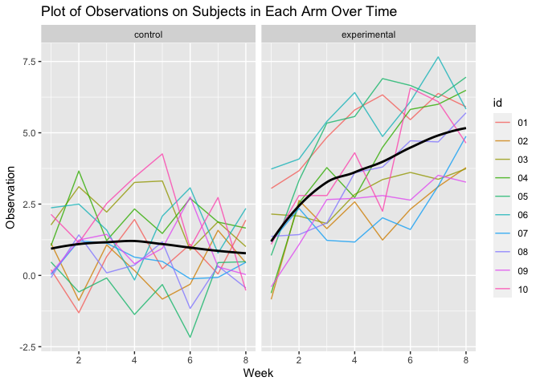

p8105_hw5_rx2236
================
Ruiqi Xue
2023-11-12

``` r
library(tibble)
library(tidyverse)
library(purrr)
library(broom)
library(ggplot2)
set.seed(1)
```

## Problem 2

Create a dataframe and read in the data iteratively.

``` r
p2_df = 
  tibble(
    file_name = list.files("data/")
    ) |>
  mutate(data = map(str_c("data/", file_name), read_csv)) |>
  unnest()
```

Tidy the dataframe.

``` r
p2_df = p2_df |>
  mutate(file_name = str_replace(file_name, ".csv", ""),
         arm = str_sub(file_name, 1, 3),
         id = str_sub(file_name, 5, 7)) |>
  pivot_longer(week_1:week_8,
               names_to = "week",
               values_to = "observation",
               names_prefix = "week_") |>
  mutate(week = as.numeric(week),
         arm = case_match(
           arm,
           "con" ~ "control",
           "exp" ~ "experimental"
         )) |>
  select(arm, id, week, observation)

p2_df
```

    ## # A tibble: 160 × 4
    ##    arm     id     week observation
    ##    <chr>   <chr> <dbl>       <dbl>
    ##  1 control 01        1        0.2 
    ##  2 control 01        2       -1.31
    ##  3 control 01        3        0.66
    ##  4 control 01        4        1.96
    ##  5 control 01        5        0.23
    ##  6 control 01        6        1.09
    ##  7 control 01        7        0.05
    ##  8 control 01        8        1.94
    ##  9 control 02        1        1.13
    ## 10 control 02        2       -0.88
    ## # ℹ 150 more rows

Make a spaghetti plot showing observations on each subject over time.

``` r
p2_df |>
  group_by(arm, id) |>
  ggplot(aes(x = week, y = observation, color = id)) +
  geom_line(alpha = 0.8) +
  facet_grid(~arm) +
  geom_smooth(aes(group = 1), se = FALSE, color = "black") +
  labs(x = 'Week', y = 'Observation', title = 'Plot of Observations on Subjects in Each Arm Over Time')
```

    ## `geom_smooth()` using method = 'loess' and formula = 'y ~ x'

<!-- -->

Compare the two arms, we see that values in the control arm fluctuate
placidly over time, whereas values in the experimental arm are higher
than the ones in the control arm in general, and have an increasing
tendency over time.
