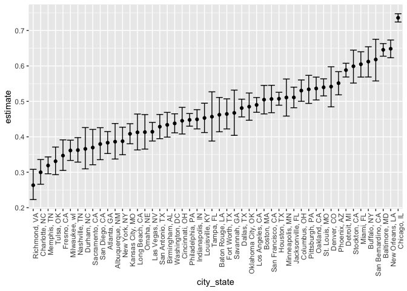
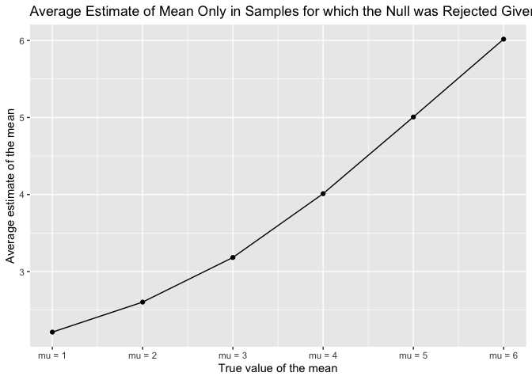
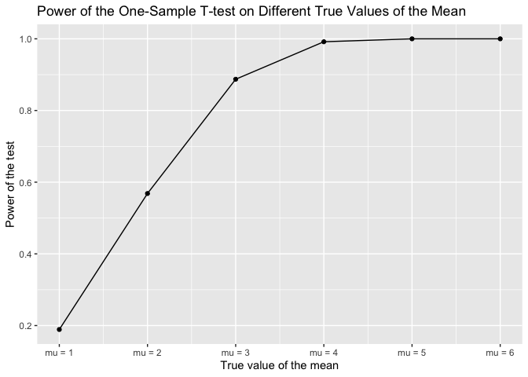
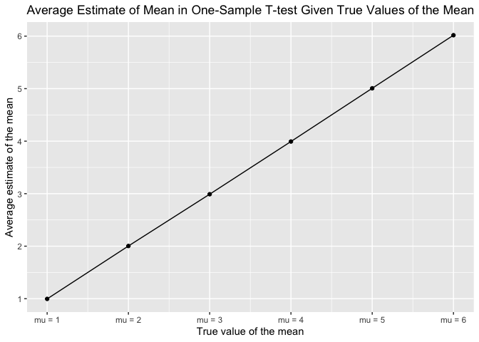

p8105_hw5_rx2236
================
Ruiqi Xue
2023-11-12

``` r
library(tibble)
library(tidyverse)
library(purrr)
library(broom)
library(ggplot2)
set.seed(1)
```

## Problem 1

For this problem, we are interested in data gathered and made public by
*The Washington Post* on homicides in 50 large U.S. cities. The code
chunk below imports and cleans the data.

``` r
homicide_df = 
  read_csv("homicide-data.csv", na = c("", "NA", "Unknown")) |>
  mutate(
    city_state = str_c(city, state, sep = ", "),
    resolution = case_when(
      disposition == "Closed without arrest" ~ "unsolved",
      disposition == "Open/No arrest"        ~ "unsolved",
      disposition == "Closed by arrest"      ~ "solved"
    )
  ) |>
  filter(city_state != "Tulsa, AL") 
```

    ## Rows: 52179 Columns: 12
    ## ── Column specification ────────────────────────────────────────────────────────
    ## Delimiter: ","
    ## chr (8): uid, victim_last, victim_first, victim_race, victim_sex, city, stat...
    ## dbl (4): reported_date, victim_age, lat, lon
    ## 
    ## ℹ Use `spec()` to retrieve the full column specification for this data.
    ## ℹ Specify the column types or set `show_col_types = FALSE` to quiet this message.

The resulting dataframe has 52178 entries, on variables that include the
victim name, race, age, and sex; the date the homicide was reported; and
the location of the homicide. In cleaning, we create a `city_state`
variable that includes both city and state, and a `resolution` variable
to indicate whether the case was closed by arrest. we also excluded one
entry in Tulsa, AL, which is not a major US city and is most likely a
data entry error.

In the next code chunk, we group within cities and summarize to produce
the total number of homicides and the number that are solved.

``` r
city_homicide_df = 
  homicide_df |>
  select(city_state, disposition, resolution) |>
  group_by(city_state) |>
  summarize(
    hom_total = n(),
    hom_unsolved = sum(resolution == "unsolved"))
```

Focusing only on Baltimore, MD, we can use the `prop.test` and
`broom::tidy` functions to obtain an estimate and CI of the proportion
of unsolved homicides in that city. The table below shows those values.

``` r
bmore_test = 
  prop.test(
    x = filter(city_homicide_df, city_state == "Baltimore, MD") |> pull(hom_unsolved),
    n = filter(city_homicide_df, city_state == "Baltimore, MD") |> pull(hom_total)) 

broom::tidy(bmore_test) |> 
  knitr::kable(digits = 3)
```

| estimate | statistic | p.value | parameter | conf.low | conf.high | method                                               | alternative |
|---------:|----------:|--------:|----------:|---------:|----------:|:-----------------------------------------------------|:------------|
|    0.646 |   239.011 |       0 |         1 |    0.628 |     0.663 | 1-sample proportions test with continuity correction | two.sided   |

Building on this code, we can use functions in the `purrr` package to
obtain estimates and CIs for the proportion of unsolved homicides in
each city in the dataset. The code below implements this analysis.

``` r
test_results = 
  city_homicide_df |> 
  mutate(
    prop_tests = map2(hom_unsolved, hom_total, \(x, y) prop.test(x = x, n = y)),
    tidy_tests = map(prop_tests, broom::tidy)) |>
  select(-prop_tests) |> 
  unnest(tidy_tests) |> 
  select(city_state, estimate, conf.low, conf.high) |>
  mutate(city_state = fct_reorder(city_state, estimate))
```

Finally, make a plot showing the estimate (and CI) of the proportion of
unsolved homicides in each city.

``` r
test_results |>
  mutate(city_state = fct_reorder(city_state, estimate)) |> 
  ggplot(aes(x = city_state, y = estimate)) + 
  geom_point() + 
  geom_errorbar(aes(ymin = conf.low, ymax = conf.high)) + 
  theme(axis.text.x = element_text(angle = 90, hjust = 1))
```

<!-- -->

This figure suggests a very wide range in the rate at which homicides
are solved – Chicago is noticeably high and, given the narrowness of the
CI, likely is the location of many homicides.

## Problem 2

Create a dataframe and read in the data iteratively.

``` r
p2_df = 
  tibble(
    file_name = list.files("data/")
    ) |>
  mutate(data = map(str_c("data/", file_name), read_csv)) |>
  unnest()
```

Tidy the dataframe.

``` r
p2_df = p2_df |>
  mutate(file_name = str_replace(file_name, ".csv", ""),
         arm = str_sub(file_name, 1, 3),
         id = str_sub(file_name, 5, 7)) |>
  pivot_longer(week_1:week_8,
               names_to = "week",
               values_to = "observation",
               names_prefix = "week_") |>
  mutate(week = as.numeric(week),
         arm = case_match(
           arm,
           "con" ~ "control",
           "exp" ~ "experimental"
         )) |>
  select(arm, id, week, observation)

p2_df
```

    ## # A tibble: 160 × 4
    ##    arm     id     week observation
    ##    <chr>   <chr> <dbl>       <dbl>
    ##  1 control 01        1        0.2 
    ##  2 control 01        2       -1.31
    ##  3 control 01        3        0.66
    ##  4 control 01        4        1.96
    ##  5 control 01        5        0.23
    ##  6 control 01        6        1.09
    ##  7 control 01        7        0.05
    ##  8 control 01        8        1.94
    ##  9 control 02        1        1.13
    ## 10 control 02        2       -0.88
    ## # ℹ 150 more rows

Make a spaghetti plot showing observations on each subject over time.

``` r
p2_df |>
  group_by(arm, id) |>
  ggplot(aes(x = week, y = observation, color = id)) +
  geom_line(alpha = 0.8) +
  facet_grid(~arm) +
  geom_smooth(aes(group = 1), se = FALSE, color = "black") +
  labs(x = 'Week', y = 'Observation', title = 'Plot of Observations on Subjects in Each Arm Over Time')
```

    ## `geom_smooth()` using method = 'loess' and formula = 'y ~ x'

<!-- -->

Compare the two arms, we see that values in the control arm fluctuate
placidly over time, whereas values in the experimental arm are higher
than the ones in the control arm in general, and have an increasing
tendency over time.

## Problem 3

Set mu = 0,simulate 5000 datasets.

``` r
sim_t_test = function(mu = mu, n = 30, sigma = 5) {
  sim_data = tibble(
    x = rnorm(n, mean = mu, sd = sigma)
    )
  sim_result = broom::tidy(t.test(sim_data))
  sim_result |> 
    select(estimate, p.value)
    
}

sim_results_df = expand_grid(
  mu = 0,
  iter = 1:5000) |>
  mutate(estimate_df = map(mu, sim_t_test)) |> 
  unnest(estimate_df) |>
  rename("mu_estimate" = estimate) |>
  rename("p_value" = "p.value")
  

sim_results_df
```

    ## # A tibble: 5,000 × 4
    ##       mu  iter mu_estimate p_value
    ##    <dbl> <int>       <dbl>   <dbl>
    ##  1     0     1       0.412  0.629 
    ##  2     0     2       0.664  0.368 
    ##  3     0     3       0.551  0.534 
    ##  4     0     4       0.567  0.487 
    ##  5     0     5      -1.65   0.0599
    ##  6     0     6       1.19   0.229 
    ##  7     0     7       0.334  0.738 
    ##  8     0     8      -1.19   0.209 
    ##  9     0     9       0.122  0.887 
    ## 10     0    10       0.684  0.472 
    ## # ℹ 4,990 more rows

Repeat the above procedure for mu = {1,2,3,4,5,6}.

``` r
sim_result_df2 = 
  expand_grid(
    mu = c(1, 2, 3, 4, 5, 6),
    iter = 1:5000) |> 
  mutate(estimate_df = map(mu, sim_t_test)) |> 
  unnest(estimate_df) |>
  rename("mu_estimate" = estimate) |>
  rename("p_value" = "p.value")
```

Making plots.

First we make a plot showing the proportion of times the null was
rejected (the power of the test) on the y axis and the true value of μ
on the x axis.

``` r
sim_result_df2 |>
  group_by(mu) |>
  summarize(reject_count = sum(p_value <= 0.05), total_count = n(), power = reject_count / total_count) |>
  #power = mean(p_value <= 0.05)
  ggplot(aes(x = mu, y = power)) + 
  geom_point() + geom_line() +
  scale_x_continuous(labels = scales::number_format(prefix = "mu = "), breaks = seq(0,6,1)) +
  labs(x = "True value of the mean", y = "Power of the test", title = "Power of the One-Sample T-test on Different True Values of the Mean")
```

<!-- -->

We can see that the association between effect size (i.e., difference in
true mean and null hypothesis mean) and power is positive, that the
larger the true value of mean, the larger the effect size, the higher
the power of the test.

Second we make a plot showing the average estimate of μ̂ on the y axis
and the true value of μ on the x axis.

``` r
sim_result_df2 |>
  group_by(mu) |>
  summarize(average_estimate = mean(mu_estimate)) |>
  ggplot(aes(x = mu, y = average_estimate)) + 
  geom_point() + geom_line() +
  scale_x_continuous(labels = scales::number_format(prefix = "mu = "), breaks = seq(0,6,1)) +
  scale_y_continuous(breaks = seq(0,6,1)) +
  labs(x = "True value of the mean", y = "Average estimate of the mean", title = "Average Estimate of Mean in One-Sample T-test Given True Values of the Mean")
```

<!-- -->

We can see that the sample average of estimated means across all tests
is approximately equal to the true value of mean.

Then we make another plot showing the average estimate of μ̂ only in
samples for which the null was rejected on the y axis and the true value
of μ on the x axis.

``` r
sim_result_df2 |>
  filter(p_value <= 0.05) |>
  group_by(mu) |>
  summarize(average_estimate = mean(mu_estimate)) |>
  ggplot(aes(x = mu, y = average_estimate)) + 
  geom_point() + geom_line() +
  scale_x_continuous(labels = scales::number_format(prefix = "mu = "), breaks = seq(0,6,1)) +
  scale_y_continuous(breaks = seq(0,6,1)) +
  labs(x = "True value of the mean", y = "Average estimate of the mean", title = "Average Estimate of Mean Only in Samples for which the Null was Rejected Given True Values of the Mean")
```

<!-- -->

``` r
sim_result_df2 |>
  filter(p_value <= 0.05) |>
  group_by(mu) |>
  summarize(average_estimate = mean(mu_estimate))
```

    ## # A tibble: 6 × 2
    ##      mu average_estimate
    ##   <dbl>            <dbl>
    ## 1     1             2.21
    ## 2     2             2.60
    ## 3     3             3.18
    ## 4     4             4.01
    ## 5     5             5.01
    ## 6     6             6.02

From this graph, we see that the sample average of estimated means
across tests for which the null is rejected is not approximately equal
to the true value of mean, (although it tend to get closer as the true
value of the mean increases). This is because we reject the null at an
0.05 significance level, meaning that there is a 5% probability that the
null hypothesis is rejected when it is actually true (type I error).
Therefore, the average of estimated means across tests where the null
hypothesis is rejected may not be exactly equal to the true value of the
sample mean.
